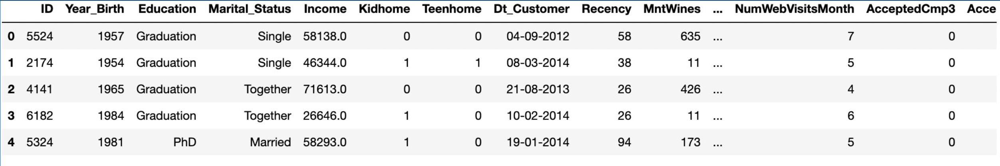
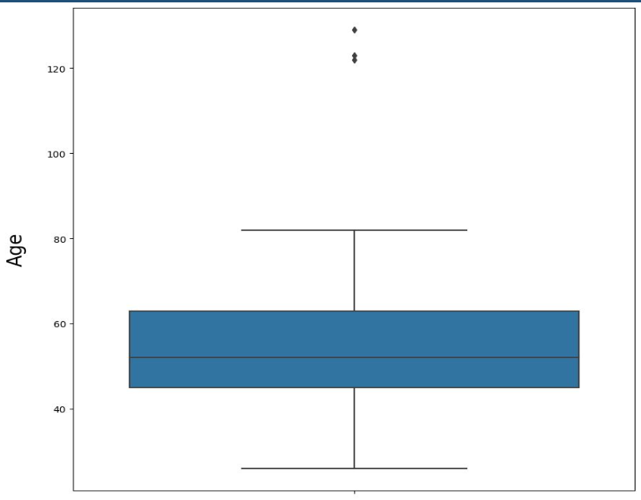
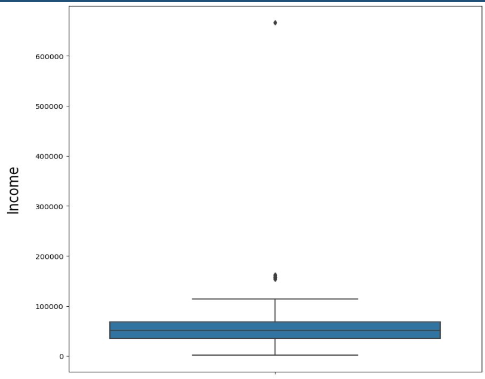
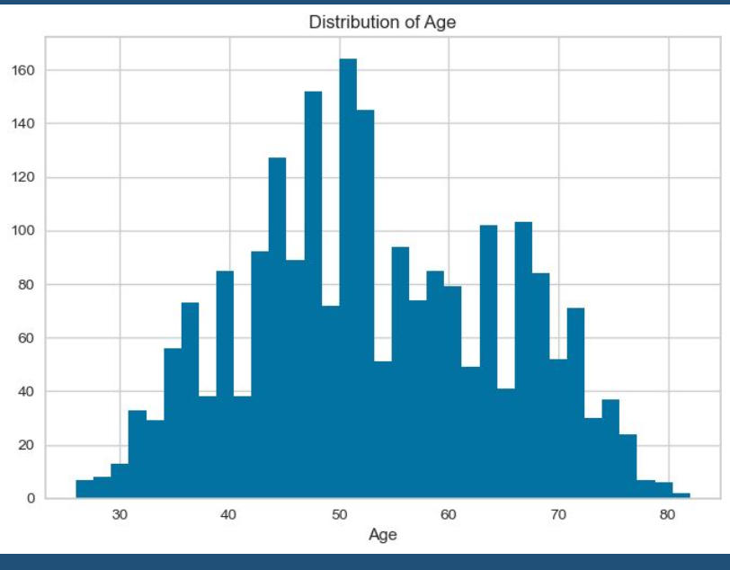
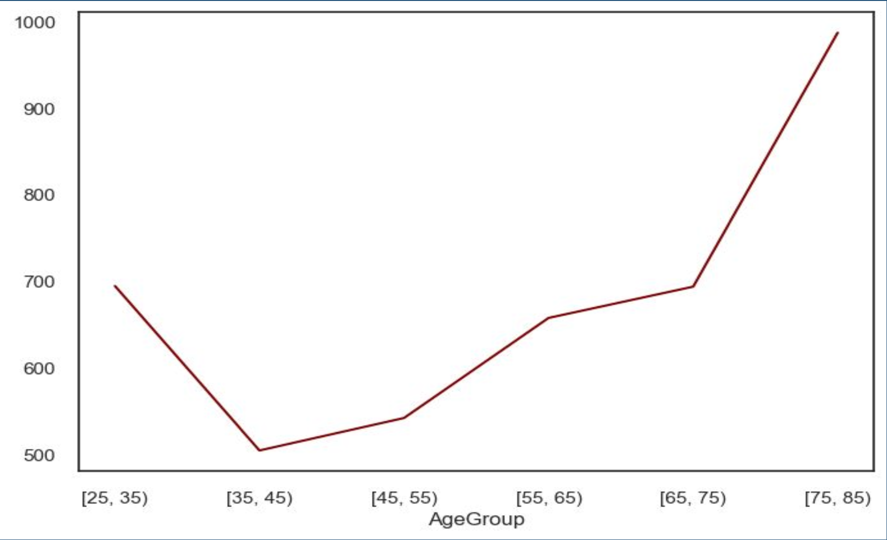
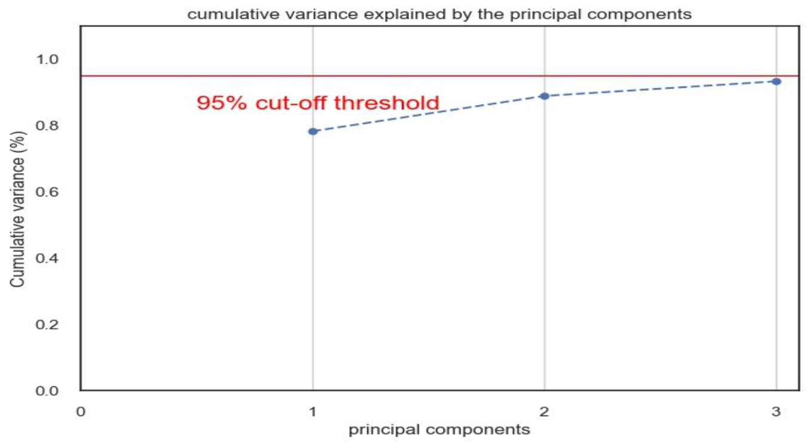
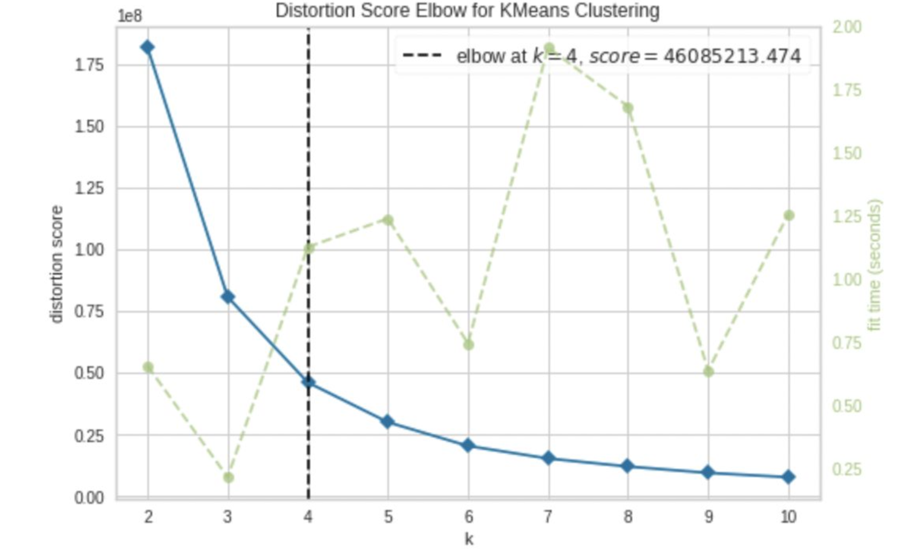

# Customer segmentation using their spending personality
An Unsupervised Machine Learning (USML) Project for DS5230

## Description
This project was part of Unsupervised Machine Learning (USML: DS 5230) under Prof. Roi Yehoshua in Fall 2022.

### Problem statement
It is necessary to understand the interaction patterns between online companies and their customers for online market growth. To develop and provide personalized products and services, it is important to know about customers' preferences. However, we have found that the clusters formed based on only their age, gender, location, etc. are not sufficiently discriminatory for micro-segmentation. The problem intends to develop segments that match individual customers' personalities based on their spending amount for each product.

### Dataset
- Data has 2240 rows and 29 different features which can be generalized into four categories i.e. People, Product, Promotion, Place

> https://www.kaggle.com/code/sonalisingh1411/customer-personality-analysis-segmentation/data

### EDA and Pre-processing
- High dimensionality is present in the dataset thus the amount of memory that it uses will be reduced. Some features have high cardinality which will be removed. 
- We will detect missing values if there are any. Categorical features will be converted before feeding into
the models.

#### Box plot - Age

#### Box plot - Income

#### Distribution plot - Age

#### Average income group

### Algorithms

- As the dataset consists of 29 features, dimensionality reduction techniques such as PCA is used to reduce dimensionality. 

- Clustering algorithms such as Kmeans, Hierarchical clustering is used to make segments of customers. 

- DBSCAN is used for detecting outliers in the data. 
- Long short-term memory (LSTM) and feed-forward neural networks to check whether they can better learn and distinguish segments or not. 
- Recurrent neural networks can produce micro-segments whereas feed-forward networks produce only coarse segments.

### Evaluation

The project yielded different groups of customers who have similar interests falling into the same clusters. The outliers, were checked if they are making their cluster which can produce valuable insight for a company. Neural network models performed better because of their hold on detecting complex patterns and relationships.

### Libraries

- pandas
- pytorch
- scikit-learn
- numpy
- matplotlib
- seaborn

## Other Contributors
- Reem Ghabayen (https://github.com/ReemGhabayen)
- Nidhi Bodar ()
